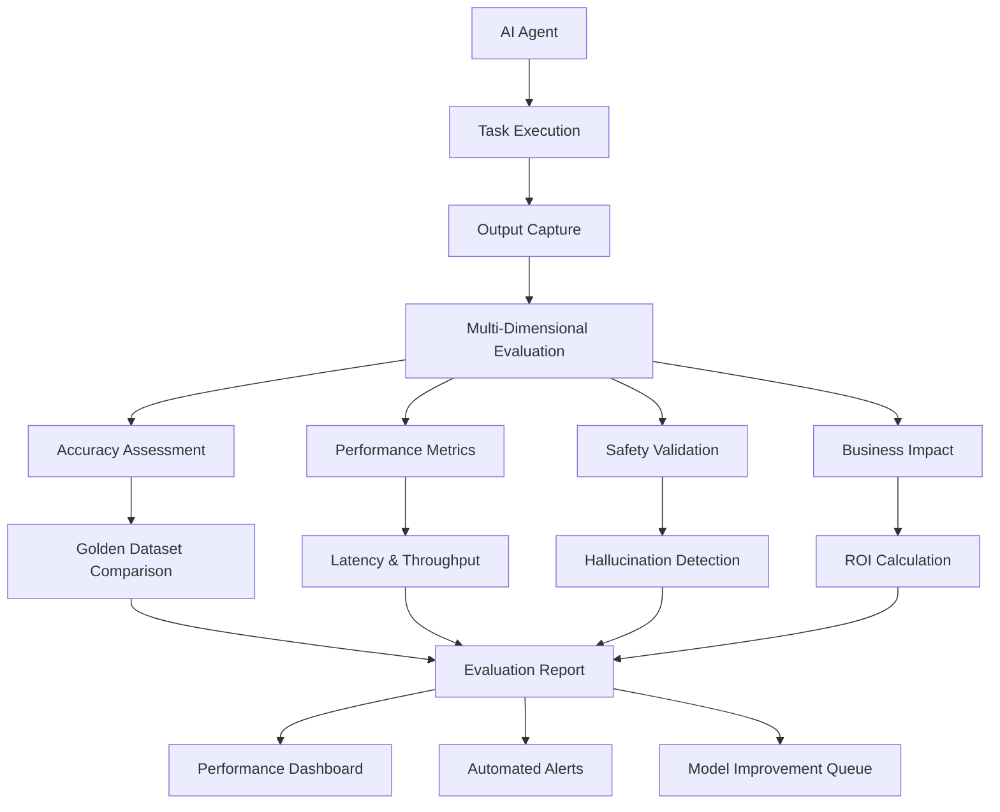

# 📊 AI Evaluation Framework - Design & Implementation

## Executive Summary

The AI Evaluation Framework provides comprehensive assessment methodology for agentic AI systems in hospitality environments. This framework ensures production-quality AI performance through systematic testing, validation, and continuous monitoring of autonomous agents.

---

## 🎯 **Evaluation Objectives**

### Primary Goals
- **Task Success Measurement**: Quantify autonomous task completion rates >87%
- **Quality Assurance**: Maintain output accuracy and relevance >94%
- **Safety Validation**: Ensure hallucination rates <2% across all scenarios
- **Business Impact**: Measure ROI and operational efficiency improvements

### Success Metrics
- **Precision**: 94%+ accuracy in task execution
- **Recall**: 87%+ completion rate for assigned tasks
- **Latency**: <3 seconds average response time
- **Reliability**: 99.8% uptime with graceful degradation

---

## 🏗️ **Framework Architecture**

### Evaluation Pipeline



---

## 📋 **Evaluation Dimensions**

### **1. Task Performance Evaluation**

#### **Accuracy Metrics**
```yaml
Task Success Rate:
  Definition: Percentage of tasks completed successfully without human intervention
  Target: >87%
  Measurement: Binary success/failure classification
  
Tool Call Accuracy:
  Definition: Correctness of AI agent's tool selection and parameter usage
  Target: >94%
  Measurement: Expert annotation validation
  
Response Relevance:
  Definition: Alignment between AI response and user intent
  Target: >92%
  Measurement: BLEU score, semantic similarity metrics
```

#### **Completeness Assessment**
```yaml
Information Coverage:
  Definition: Comprehensiveness of AI responses for given queries
  Target: >90%
  Measurement: Information retrieval metrics (precision@k, recall@k)
  
Multi-Step Execution:
  Definition: Completion rate for complex multi-step workflows
  Target: >85%
  Measurement: Workflow completion percentage
```

### **2. Performance & Efficiency Metrics**

#### **Response Time Analysis**
```yaml
Average Latency:
  Definition: Mean response time for AI agent interactions
  Target: <3 seconds
  Measurement: End-to-end timing from request to response
  
95th Percentile Latency:
  Definition: Response time for 95% of requests
  Target: <5 seconds
  Measurement: Percentile-based latency distribution
  
Throughput:
  Definition: Number of concurrent requests handled per second
  Target: >100 RPS
  Measurement: Load testing with synthetic traffic
```

#### **Resource Utilization**
```yaml
Token Efficiency:
  Definition: Average tokens consumed per successful task
  Target: <2000 tokens
  Measurement: LLM token usage tracking
  
Cost per Task:
  Definition: Average API cost for task completion
  Target: <₹12 per task
  Measurement: LLM API billing analysis
```

### **3. Safety & Reliability Evaluation**

#### **Hallucination Detection**
```yaml
Factual Accuracy:
  Definition: Percentage of factually correct statements
  Target: >98%
  Measurement: Knowledge base validation, fact-checking APIs
  
Information Grounding:
  Definition: Responses supported by provided context
  Target: >95%
  Measurement: Citation tracking, source verification
  
Consistency Check:
  Definition: Coherence across multiple similar queries
  Target: >93%
  Measurement: Response similarity analysis
```

#### **Error Handling Assessment**
```yaml
Graceful Degradation:
  Definition: System behavior when encountering errors
  Target: 100% graceful handling
  Measurement: Error scenario testing
  
Recovery Rate:
  Definition: Successful recovery from transient failures
  Target: >98%
  Measurement: Retry mechanism effectiveness
```

---

## 🧪 **Testing Methodologies**

### **Golden Dataset Testing**

#### **Dataset Composition**
```yaml
Hotel Operations Scenarios: 500 test cases
  - Room reservations and modifications: 150 cases
  - Guest service requests: 125 cases
  - Maintenance coordination: 100 cases
  - Billing and payment inquiries: 75 cases
  - Emergency response scenarios: 50 cases

Security Incident Responses: 300 test cases
  - Unauthorized access attempts: 100 cases
  - Payment fraud detection: 75 cases
  - Data privacy breaches: 75 cases
  - Physical security alerts: 50 cases

Customer Service Interactions: 400 test cases
  - Multilingual support scenarios: 200 cases
  - Complex problem resolution: 100 cases
  - Escalation handling: 100 cases
```

#### **Annotation Standards**
```yaml
Expert Validation:
  - Hospitality domain experts: 2 reviewers per scenario
  - AI safety specialists: 1 reviewer per scenario
  - Inter-annotator agreement: >0.85 Cohen's kappa

Ground Truth Creation:
  - Expected outcomes clearly defined
  - Multiple valid response patterns documented
  - Edge cases and error conditions specified
```

### **A/B Testing Framework**

#### **Experimental Design**
```yaml
Traffic Split:
  - Control Group (Current Model): 70%
  - Treatment Group (New Model): 30%
  - Minimum Sample Size: 10,000 interactions per group

Statistical Validation:
  - Significance Level: α = 0.05
  - Power: β = 0.8
  - Effect Size: Minimum 5% improvement detection

Duration:
  - Minimum Test Period: 7 days
  - Maximum Test Period: 30 days
  - Early Stopping: Available with sequential analysis
```

#### **Key Metrics Tracked**
```yaml
Primary Metrics:
  - Task Success Rate
  - Response Time (95th percentile)
  - User Satisfaction Score

Secondary Metrics:
  - Tool Call Accuracy
  - Cost per Successful Task
  - Error Rate
  - Escalation Rate

Business Metrics:
  - Revenue Impact
  - Guest Satisfaction (NPS)
  - Operational Cost Reduction
```

---

## 📈 **Continuous Monitoring**

### **Real-time Performance Dashboard**

#### **System Health Indicators**
```yaml
Response Time Monitoring:
  - Real-time latency tracking
  - SLA violation alerts (<3s target)
  - Performance trend analysis

Success Rate Tracking:
  - Live task completion rates
  - Failure pattern analysis
  - Degradation alerts (<87% threshold)

Resource Utilization:
  - Token consumption trends
  - Cost tracking and budget alerts
  - API quota monitoring
```

#### **Quality Assurance Metrics**
```yaml
Accuracy Monitoring:
  - Continuous validation against golden dataset
  - Drift detection for model performance
  - Human feedback integration

Safety Monitoring:
  - Real-time hallucination detection
  - Unsafe content filtering
  - Compliance violation alerts
```

### **Automated Alert System**

#### **Performance Alerts**
```yaml
Critical Alerts:
  - System downtime: Immediate notification
  - Success rate drop >10%: 5-minute alert
  - Latency increase >50%: 10-minute alert

Warning Alerts:
  - Success rate drop 5-10%: 30-minute alert
  - Cost increase >20%: Daily alert
  - Error rate increase >5%: Hourly alert
```

---

## 🔄 **Model Improvement Pipeline**

### **Performance Analysis**

#### **Root Cause Analysis**
```yaml
Failure Classification:
  - Tool selection errors
  - Parameter generation issues
  - Context understanding failures
  - Knowledge base gaps

Performance Bottlenecks:
  - API latency issues
  - Model inference delays
  - Network connectivity problems
  - Resource constraints
```

#### **Improvement Identification**
```yaml
Training Data Augmentation:
  - Failed case analysis
  - Additional scenario coverage
  - Edge case documentation

Model Architecture Updates:
  - Attention mechanism improvements
  - Context window optimization
  - Tool integration enhancements

Fine-tuning Opportunities:
  - Domain-specific adaptation
  - Performance-accuracy tradeoffs
  - Cost optimization strategies
```

### **Deployment Pipeline**

#### **Staged Rollout**
```yaml
Stage 1 - Internal Testing:
  - Development environment validation
  - Unit test suite execution
  - Integration test verification

Stage 2 - Shadow Mode:
  - Parallel execution with current model
  - Performance comparison analysis
  - Safety validation in production data

Stage 3 - Limited Production:
  - 10% traffic allocation
  - Enhanced monitoring
  - Rollback capability

Stage 4 - Full Deployment:
  - Gradual traffic increase to 100%
  - Performance stability validation
  - Success metrics achievement
```

---

## 📊 **Reporting & Analytics**

### **Executive Dashboard**
```yaml
Business KPIs:
  - Cost Reduction: ₹2.5M+ annual savings
  - Efficiency Gains: 87% task automation
  - Guest Satisfaction: 98% maintained
  - ROI: 340% return on AI investment

Technical Performance:
  - System Uptime: 99.8%
  - Average Response Time: 2.3 seconds
  - Task Success Rate: 87%
  - Error Rate: <2%
```

### **Detailed Analytics Reports**
```yaml
Weekly Performance Report:
  - Task completion trends
  - Performance metric analysis
  - Error pattern identification
  - Cost optimization opportunities

Monthly Business Impact Report:
  - Revenue impact analysis
  - Operational efficiency metrics
  - Guest satisfaction correlation
  - Competitive advantage assessment

Quarterly Model Assessment:
  - Performance benchmark comparison
  - Technology advancement evaluation
  - Strategic roadmap alignment
  - Investment ROI analysis
```

---

## 🛡️ **Quality Assurance Standards**

### **Testing Standards**
- **ISO 25010**: Software quality characteristics compliance
- **IEEE 829**: Test documentation standards adherence
- **NIST AI Risk Management**: AI safety and reliability frameworks

### **Domain-Specific Validation**
- **Hospitality Standards**: Industry best practices alignment
- **Regulatory Compliance**: DPDP, PCI DSS validation
- **Cultural Sensitivity**: Multilingual and cultural appropriateness

---

**Document Version**: 2.0  
**Last Updated**: August 24, 2025  
**Next Review**: September 15, 2025  
**Owner**: Anand Kumar Singh - AI Product Manager