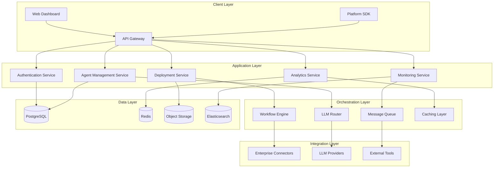
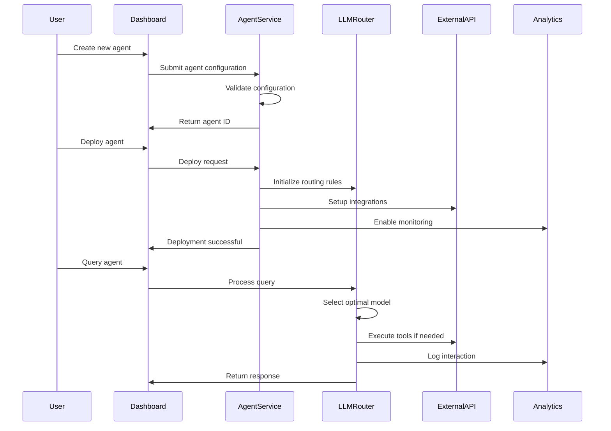

# VirtualAgent Platform MVP Specification
## Enterprise AI Agent Deployment & Management System

> **Executive Summary**: Enterprise-grade platform for deploying, managing, and scaling multiple AI agents across organizations, equivalent to Jio EVA platform capabilities

---

## 📋 Executive Summary

### Elevator Pitch
VirtualAgent Platform is the "AWS for AI Agents" - enabling enterprises to deploy, manage, and scale multiple specialized AI agents across their organization with enterprise-grade security, monitoring, and compliance.

### Problem Statement
**Core Problem**: Enterprises struggle to deploy and manage multiple AI agents at scale due to:
- **Fragmented Development**: Each use case requires separate development cycles and infrastructure
- **No Centralized Management**: No unified dashboard to monitor, update, and optimize multiple agents
- **Integration Complexity**: Difficult to integrate agents with existing enterprise systems (CRM, ERP, ticketing)
- **Compliance Gaps**: Lack of enterprise-grade audit trails, security controls, and regulatory compliance
- **Operational Overhead**: High manual effort to deploy, monitor, and maintain individual agents

### Target Audience
**Primary Segments**:

1. **Enterprise IT Directors** (Decision Makers)
   - Demographics: 10-20 years experience, managing digital transformation
   - Pain Points: Pressure to reduce operational costs while improving customer experience
   - JTBD: Deploy AI solutions that demonstrate clear ROI and integrate with existing systems

2. **AI/ML Product Managers** (Users)
   - Demographics: 5-10 years product experience, responsible for AI initiatives
   - Pain Points: Difficulty scaling AI projects from POC to production
   - JTBD: Deploy multiple AI use cases quickly with consistent quality and monitoring

3. **DevOps/Platform Engineers** (Operators)
   - Demographics: Technical teams responsible for infrastructure and deployments
   - Pain Points: Complex deployment pipelines for AI systems and monitoring challenges
   - JTBD: Standardized deployment processes and comprehensive monitoring for AI systems

### Unique Selling Proposition
**"Deploy AI agents in hours, not months"** - The only platform providing:
- **Multi-Agent Orchestration**: Deploy 20+ specialized agents from single dashboard
- **Enterprise-Grade Security**: SOC 2 compliance, audit trails, role-based access control
- **Intelligent Cost Optimization**: 60% cost reduction through LLM routing and caching
- **Zero-Code Integration**: Connect to 100+ enterprise systems without development

### Success Metrics
**Primary Success Metric**: **Agent Deployment Velocity**
- **Target**: 10x faster agent deployment (hours vs. weeks)
- **Measurement**: Time from agent specification to production deployment

**Supporting Metrics**:
- Platform Adoption Rate: 75% of enterprise AI projects use VirtualAgent Platform
- Cost Reduction: 60% reduction in AI deployment and operational costs
- Developer Productivity: 5x increase in agent deployment frequency per team

---

## 🎯 Problem Brief

### Market Context
The enterprise conversational AI market is experiencing explosive growth:
- **Market Size**: $13.2B in 2024, projected to reach $49.9B by 2030 (28% CAGR)
- **Enterprise Adoption**: 85% of enterprises plan to deploy conversational AI by 2025
- **Current Pain Point**: 67% of AI projects fail to reach production due to operational complexity

### User Research Insights
**Key Findings from Enterprise Interviews**:

1. **Deployment Bottleneck**: Average 6-month timeline from POC to production for enterprise AI agents
2. **Management Complexity**: IT teams spend 40% of time on agent maintenance vs. new development
3. **Integration Challenges**: 78% cite system integration as primary deployment blocker
4. **Cost Unpredictability**: 60% experience budget overruns due to unpredictable LLM costs

### Competitive Landscape
**Direct Competitors**:
- **Microsoft Bot Framework**: Strong enterprise integration but complex deployment
- **Google Dialogflow CX**: Good NLU but limited multi-agent management
- **Amazon Lex**: Cost-effective but basic enterprise features

**Competitive Advantage**:
- **Multi-Agent Orchestration**: Only platform designed for managing 20+ agents simultaneously
- **Cost Intelligence**: Advanced LLM routing and caching for 60% cost reduction
- **Enterprise-First Design**: Built-in compliance, audit trails, and security controls

---

## 📄 Product Requirements Document (PRD)

### 1. Multi-Agent Management Dashboard

#### Feature: Agent Lifecycle Management
**User Story**: As an AI Product Manager, I want to create, deploy, and manage multiple AI agents from a single dashboard, so that I can scale our AI initiatives across the organization without managing separate systems.

**Acceptance Criteria**:
- **Agent Creation**: Create new agents using templates or custom configurations in <5 minutes
- **Deployment Pipeline**: Deploy agents to staging/production with one-click deployment
- **Version Control**: Maintain version history with rollback capability for all agents
- **Status Monitoring**: Real-time status dashboard showing health of all deployed agents
- **Batch Operations**: Perform bulk updates across multiple agents simultaneously

**Priority**: P0 (Core platform functionality)
**Dependencies**: Authentication system, role-based access control
**Technical Constraints**: Must support 100+ agents per organization
**UX Considerations**: Single-page dashboard with agent cards, quick actions, and bulk selection

#### Feature: Agent Template Library
**User Story**: As a DevOps Engineer, I want to deploy agents using pre-built templates for common use cases, so that I can standardize deployments and reduce configuration errors.

**Acceptance Criteria**:
- **Template Catalog**: 20+ pre-built templates (customer service, sales, HR, IT support)
- **Custom Templates**: Create and share custom templates within organization
- **Configuration Override**: Customize template parameters without modifying base template
- **Template Versioning**: Track template versions and compatibility
- **Import/Export**: Import templates from other organizations or export for sharing

**Priority**: P1 (Accelerates adoption)
**Dependencies**: Agent management core system
**Technical Constraints**: Templates must be environment-agnostic
**UX Considerations**: Visual template browser with preview and parameter configuration

### 2. Enterprise Integration Hub

#### Feature: Universal API Connector
**User Story**: As a Platform Engineer, I want to connect AI agents to our existing enterprise systems (CRM, ERP, Ticketing), so that agents can access and update business data without custom development.

**Acceptance Criteria**:
- **Pre-built Connectors**: 50+ enterprise system connectors (Salesforce, ServiceNow, SAP, etc.)
- **Custom API Integration**: Visual API builder for custom endpoints
- **Authentication Support**: OAuth, SAML, API keys, and certificate-based authentication
- **Data Transformation**: Visual data mapping and transformation tools
- **Real-time Sync**: Bi-directional data synchronization with conflict resolution

**Priority**: P0 (Critical for enterprise adoption)
**Dependencies**: Security framework, audit logging
**Technical Constraints**: Must handle enterprise-scale data volumes (1M+ records)
**UX Considerations**: Visual integration builder with drag-drop interface

#### Feature: Workflow Orchestration Engine
**User Story**: As an AI Product Manager, I want to create complex multi-step workflows that span multiple agents and systems, so that I can automate end-to-end business processes.

**Acceptance Criteria**:
- **Visual Workflow Builder**: Drag-drop interface for creating multi-agent workflows
- **Conditional Logic**: Support for branching logic based on agent responses or data conditions
- **Error Handling**: Automatic retry, fallback paths, and error escalation
- **Parallel Execution**: Execute multiple workflow branches simultaneously
- **Workflow Templates**: Pre-built workflows for common business processes

**Priority**: P1 (Differentiating feature)
**Dependencies**: Multi-agent management, integration hub
**Technical Constraints**: Must support workflows with 20+ steps
**UX Considerations**: Visual workflow designer with real-time execution monitoring

### 3. Multi-LLM Orchestration Platform

#### Feature: Intelligent Model Routing
**User Story**: As an AI/ML Engineer, I want the platform to automatically route queries to the most cost-effective and appropriate LLM model, so that I can optimize performance and costs without manual management.

**Acceptance Criteria**:
- **Cost-Based Routing**: Automatically route simple queries to cost-effective models
- **Performance-Based Routing**: Route complex queries to high-performance models
- **Custom Routing Rules**: Define custom routing logic based on query type, user tier, etc.
- **Real-time Switching**: Dynamic model switching based on availability and performance
- **Fallback Mechanisms**: Automatic fallback to alternative models during outages

**Priority**: P0 (Core cost optimization)
**Dependencies**: LLM provider integrations, monitoring system
**Technical Constraints**: Sub-100ms routing decision time
**UX Considerations**: Visual routing rules builder with cost impact preview

#### Feature: LLM Provider Management
**User Story**: As a Platform Engineer, I want to manage multiple LLM providers (OpenAI, Anthropic, Gemini) from a single interface, so that I can ensure high availability and optimize costs across providers.

**Acceptance Criteria**:
- **Provider Integration**: Support for 10+ major LLM providers with unified API
- **Credential Management**: Secure storage and rotation of API keys
- **Usage Monitoring**: Real-time usage tracking and cost analytics per provider
- **Rate Limit Management**: Automatic rate limiting and quota management
- **Health Monitoring**: Continuous monitoring of provider availability and performance

**Priority**: P0 (Platform foundation)
**Dependencies**: Security framework, cost monitoring
**Technical Constraints**: Must support enterprise SLAs (99.9% uptime)
**UX Considerations**: Provider dashboard with health status and cost breakdown

### 4. Enterprise Analytics & Monitoring

#### Feature: Real-time Performance Dashboard
**User Story**: As an IT Director, I want to monitor the performance and usage of all deployed agents in real-time, so that I can ensure SLA compliance and identify optimization opportunities.

**Acceptance Criteria**:
- **Live Metrics**: Real-time dashboard showing response times, success rates, and user satisfaction
- **SLA Monitoring**: Track and alert on SLA violations with automatic escalation
- **Usage Analytics**: Query volume, peak usage patterns, and resource utilization
- **Cost Tracking**: Real-time cost monitoring with budget alerts and forecasting
- **Custom Dashboards**: Create custom dashboards for different stakeholder groups

**Priority**: P0 (Essential for operations)
**Dependencies**: Monitoring infrastructure, alerting system
**Technical Constraints**: Support for 1M+ daily interactions
**UX Considerations**: Interactive dashboards with drill-down capabilities

#### Feature: Conversation Analytics Platform
**User Story**: As an AI Product Manager, I want to analyze conversation patterns and identify improvement opportunities, so that I can continuously optimize agent performance and user experience.

**Acceptance Criteria**:
- **Intent Analysis**: Automatic categorization and trending of user intents
- **Sentiment Analysis**: Real-time sentiment tracking and alerting on negative trends
- **Conversation Flow Analysis**: Visualization of user journey paths and drop-off points
- **Success Rate Tracking**: Measure task completion rates and identify failure patterns
- **A/B Testing Framework**: Built-in testing for conversation flows and responses

**Priority**: P1 (Optimization and insights)
**Dependencies**: NLP analytics engine, data warehouse
**Technical Constraints**: Process 100K+ conversations daily
**UX Considerations**: Interactive analytics with natural language querying

### 5. Security & Compliance Framework

#### Feature: Enterprise Security Controls
**User Story**: As a Security Officer, I want comprehensive security controls and audit trails for all AI agent interactions, so that I can ensure regulatory compliance and protect sensitive data.

**Acceptance Criteria**:
- **Role-Based Access Control**: Granular permissions for agent management and data access
- **Audit Trails**: Complete logging of all system interactions and data access
- **Data Encryption**: End-to-end encryption for data in transit and at rest
- **PII Detection**: Automatic detection and masking of personally identifiable information
- **Compliance Reporting**: Automated reports for SOC 2, GDPR, HIPAA compliance

**Priority**: P0 (Enterprise requirement)
**Dependencies**: Identity management system, logging infrastructure
**Technical Constraints**: Must meet enterprise security standards
**UX Considerations**: Security dashboard with compliance status and recommendations

#### Feature: Multi-Tenant Architecture
**User Story**: As a Platform Administrator, I want to support multiple organizations with complete data isolation, so that I can serve enterprise customers while ensuring data security and privacy.

**Acceptance Criteria**:
- **Tenant Isolation**: Complete data and resource isolation between organizations
- **Resource Quotas**: Configurable limits on agent count, usage, and storage per tenant
- **Custom Branding**: White-label capabilities for enterprise customers
- **Tenant Administration**: Self-service tenant management and user provisioning
- **Cross-Tenant Analytics**: Aggregated analytics while maintaining data privacy

**Priority**: P0 (Platform scalability)
**Dependencies**: Database design, authentication system
**Technical Constraints**: Support 1000+ tenants with linear scaling
**UX Considerations**: Tenant switcher with clear organization context

---

## 🏗️ Technical Architecture Overview

### System Architecture

### Core Components

#### 1. Agent Management Service
**Responsibilities**:
- Agent lifecycle management (create, update, deploy, retire)
- Version control and rollback capabilities
- Template management and instantiation
- Configuration validation and testing

**Technology Stack**:
- **Language**: Python 3.11 with FastAPI
- **Database**: PostgreSQL for metadata, Redis for session state
- **Deployment**: Kubernetes with Helm charts
- **Monitoring**: Prometheus and Grafana

#### 2. LLM Orchestration Engine
**Responsibilities**:
- Intelligent routing based on cost, performance, and availability
- Provider abstraction and failover management
- Cost optimization and usage analytics
- Response caching and performance optimization

**Technology Stack**:
- **Language**: Python with asyncio for high concurrency
- **Caching**: Redis Cluster for distributed caching
- **Monitoring**: Custom metrics for routing decisions
- **Providers**: OpenAI, Anthropic, Google, Cohere, Azure OpenAI

#### 3. Enterprise Integration Hub
**Responsibilities**:
- Pre-built connectors for major enterprise systems
- Custom API integration capabilities
- Data transformation and mapping
- Authentication and security management

**Technology Stack**:
- **Integration Framework**: Apache Camel for enterprise patterns
- **API Management**: Kong for rate limiting and authentication
- **Data Pipeline**: Apache Kafka for real-time data streaming
- **Security**: OAuth 2.0, SAML, JWT token management

### Data Flow Architecture

### Scalability & Performance

#### Horizontal Scaling Strategy
- **Microservices Architecture**: Each service scales independently
- **Database Sharding**: Partition data by tenant for linear scaling
- **CDN Integration**: Global content delivery for dashboard assets
- **Auto-scaling**: Kubernetes HPA based on CPU, memory, and custom metrics

#### Performance Targets
| Metric | Target | Measurement |
|--------|--------|-------------|
| API Response Time | <200ms | P95 latency |
| Agent Deployment Time | <5 minutes | End-to-end deployment |
| Concurrent Users | 10,000+ | Platform dashboard users |
| Agent Throughput | 1M+ queries/day | Per agent capacity |
| System Uptime | 99.9% | Monthly availability |

---

## 📊 MVP Feature Breakdown & Prioritization

### RICE Prioritization Framework

| Feature | Reach | Impact | Confidence | Effort | RICE Score | Priority |
|---------|--------|--------|------------|--------|------------|----------|
| Agent Management Dashboard | 1000 | 3 | 100% | 8 | 375 | P0 |
| LLM Router & Cost Optimization | 1000 | 3 | 90% | 6 | 450 | P0 |
| Enterprise Integration Hub | 800 | 3 | 85% | 13 | 156 | P0 |
| Real-time Analytics Dashboard | 1000 | 2 | 95% | 5 | 380 | P0 |
| Security & Compliance Framework | 1000 | 3 | 100% | 10 | 300 | P0 |
| Workflow Orchestration Engine | 600 | 2 | 80% | 8 | 120 | P1 |
| Agent Template Library | 800 | 2 | 90% | 3 | 480 | P1 |
| Advanced Conversation Analytics | 500 | 2 | 70% | 5 | 140 | P1 |
| Multi-tenant White Labeling | 300 | 3 | 80% | 13 | 55 | P2 |
| Mobile Dashboard App | 400 | 1 | 90% | 8 | 45 | P2 |

### MVP Phase 1 (Months 1-3): Core Platform

**Sprint 1-2: Foundation**
- User authentication and authorization system
- Basic agent management dashboard
- PostgreSQL database schema and Redis setup
- API gateway and service mesh setup

**Sprint 3-4: Agent Management**
- Agent creation and configuration interface
- Basic deployment pipeline
- Version control and rollback capabilities
- Agent status monitoring

**Sprint 5-6: LLM Integration**
- LLM provider integrations (OpenAI, Anthropic, Google)
- Basic routing and failover logic
- Cost tracking and usage analytics
- Response caching layer

### MVP Phase 2 (Months 4-6): Enterprise Features

**Sprint 7-8: Integration Hub**
- Pre-built connectors for top 10 enterprise systems
- Custom API integration builder
- Authentication and security management
- Data transformation capabilities

**Sprint 9-10: Analytics & Monitoring**
- Real-time performance dashboard
- SLA monitoring and alerting
- Basic conversation analytics
- Cost optimization recommendations

**Sprint 11-12: Security & Compliance**
- Role-based access control implementation
- Audit trail and compliance reporting
- PII detection and data masking
- SOC 2 compliance framework

### MVP Phase 3 (Months 7-9): Advanced Features

**Sprint 13-14: Workflow Engine**
- Visual workflow builder
- Multi-agent orchestration
- Conditional logic and error handling
- Workflow templates library

**Sprint 15-16: Advanced Analytics**
- Intent and sentiment analysis
- Conversation flow optimization
- A/B testing framework
- Predictive analytics and recommendations

**Sprint 17-18: Scale & Optimization**
- Multi-tenant architecture completion
- Performance optimization and caching
- Advanced security features
- Enterprise-grade monitoring

---

## 🚀 Go-to-Market Strategy

### Market Entry Strategy

#### Phase 1: Enterprise Early Adopters (Months 1-6)
**Target**: 10 enterprise customers with existing AI initiatives

**Customer Acquisition**:
- **Direct Sales**: Dedicated enterprise sales team
- **Partner Channel**: System integrators and consulting firms
- **Proof of Concept**: 30-day free trial with migration support
- **Customer Success**: Dedicated success managers for onboarding

**Value Proposition**:
- **ROI Focus**: Demonstrate 60% cost reduction in AI operations
- **Time to Value**: Deploy first agent in <1 week vs. 3-6 months
- **Risk Reduction**: Enterprise-grade security and compliance built-in

#### Phase 2: Market Expansion (Months 7-12)
**Target**: 100+ enterprise customers across industries

**Scaling Strategy**:
- **Industry Verticals**: Financial services, healthcare, telecommunications, retail
- **Partner Ecosystem**: Technology partnerships with major cloud providers
- **Self-Service Tier**: Freemium model for smaller teams and startups
- **Marketplace**: Agent template marketplace for community contributions

### Pricing Strategy

#### Tiered Pricing Model

**Starter Tier**: $2,000/month
- Up to 5 agents
- 100K queries/month
- Basic integrations (10 connectors)
- Standard support
- Target: Small enterprises and AI teams

**Professional Tier**: $10,000/month
- Up to 25 agents
- 1M queries/month
- Advanced integrations (50+ connectors)
- Workflow orchestration
- Priority support
- Target: Mid-market enterprises

**Enterprise Tier**: Custom pricing
- Unlimited agents
- Unlimited queries
- Custom integrations
- White-label capabilities
- Dedicated success manager
- 24/7 support
- Target: Large enterprises

#### Enterprise Sales Process

**Stage 1: Discovery & Qualification (Weeks 1-2)**
- Initial discovery call to understand AI maturity and use cases
- Technical architecture review and integration requirements
- Stakeholder mapping and decision process understanding

**Stage 2: Proof of Concept (Weeks 3-6)**
- Deploy 2-3 agents addressing specific use cases
- Integrate with 1-2 existing enterprise systems
- Measure and document cost savings and performance improvements

**Stage 3: Pilot Deployment (Weeks 7-10)**
- Expand to 10+ agents across multiple departments
- Full integration with enterprise systems
- Train internal teams on platform usage
- Establish success metrics and monitoring

**Stage 4: Enterprise Rollout (Weeks 11-16)**
- Organization-wide deployment
- Advanced features implementation
- Custom integrations and workflows
- Long-term partnership and expansion planning

### Competitive Positioning

#### Competitive Advantages

**vs. Microsoft Bot Framework**:
- **Simplicity**: No-code agent creation vs. complex development requirements
- **Cost Optimization**: Built-in LLM cost management vs. manual optimization
- **Multi-Agent Management**: Unified dashboard for 100+ agents vs. individual management

**vs. Google Dialogflow CX**:
- **Enterprise Integration**: 50+ pre-built connectors vs. custom integration effort
- **Multi-LLM Support**: Provider flexibility vs. Google-only ecosystem
- **Advanced Analytics**: Conversation intelligence vs. basic reporting

**vs. Amazon Lex**:
- **Enterprise Features**: Built-in compliance and security vs. custom implementation
- **Workflow Orchestration**: Visual multi-agent workflows vs. single-agent limitations
- **Cost Intelligence**: Automated cost optimization vs. manual management

#### Market Differentiation

**"The Enterprise AI Agent Platform"**:
- **Enterprise-First Design**: Built for compliance, security, and scale from day one
- **Multi-Agent Intelligence**: Only platform designed for managing 100+ agents
- **Cost Optimization**: 60% cost reduction through intelligent LLM routing
- **Integration-Native**: 50+ enterprise connectors with visual workflow builder

---

## 📈 Success Metrics & KPIs

### North Star Metrics

#### Primary Success Metric: Agent Deployment Velocity
**Definition**: Time from agent specification to production deployment
- **Target**: <24 hours for standard agents, <1 week for complex integrations
- **Current Industry**: 4-12 weeks average
- **Measurement**: Automated tracking through deployment pipeline

#### Secondary Success Metrics

**1. Platform Adoption Rate**
- **Target**: 75% of enterprise AI projects use VirtualAgent Platform
- **Measurement**: Market research and customer surveys
- **Timeline**: 18 months post-launch

**2. Cost Reduction Achievement**
- **Target**: 60% reduction in AI deployment and operational costs
- **Measurement**: Customer ROI studies and before/after analysis
- **Timeline**: 6 months post-implementation

**3. Developer Productivity Increase**
- **Target**: 5x increase in agent deployment frequency per team
- **Measurement**: Customer usage analytics and productivity surveys
- **Timeline**: 3 months post-adoption

### Operational Metrics

#### Product Performance KPIs

| Category | Metric | Target | Frequency |
|----------|--------|--------|-----------|
| **Platform Performance** | API Response Time | <200ms P95 | Real-time |
| **Platform Performance** | System Uptime | 99.9% | Monthly |
| **Platform Performance** | Agent Deployment Success Rate | >95% | Daily |
| **User Engagement** | Daily Active Users | 80% of licensed users | Daily |
| **User Engagement** | Feature Adoption Rate | >60% for core features | Weekly |
| **User Engagement** | User Session Duration | >30 minutes average | Daily |
| **Business Impact** | Customer Satisfaction (CSAT) | >4.5/5 | Monthly |
| **Business Impact** | Net Promoter Score | >50 | Quarterly |
| **Business Impact** | Customer Retention Rate | >95% annually | Monthly |

#### Business Metrics

**Revenue Growth**:
- **Monthly Recurring Revenue (MRR)**: Target $1M MRR by month 12
- **Annual Contract Value (ACV)**: Target $50K average ACV
- **Revenue per Customer**: Target $60K annual revenue per enterprise customer

**Customer Success**:
- **Time to First Value**: <1 week for first agent deployment
- **Expansion Revenue**: 40% revenue growth from existing customers
- **Customer Lifetime Value**: $300K average LTV for enterprise customers

**Operational Efficiency**:
- **Cost per Acquisition (CAC)**: <$5K for enterprise customers
- **LTV/CAC Ratio**: >10:1 target ratio
- **Gross Revenue Retention**: >95% annually

### Analytics & Measurement Framework

#### Data Collection Strategy

**Product Analytics**:
- **Tool**: Mixpanel for user behavior tracking
- **Events**: Agent creation, deployment, usage, and performance metrics
- **Dashboards**: Real-time executive dashboards with key metrics

**Customer Success Analytics**:
- **Tool**: Gainsight for customer health scoring
- **Metrics**: Usage adoption, feature utilization, support ticket trends
- **Alerts**: Automated alerts for at-risk customers

**Business Intelligence**:
- **Tool**: Looker for comprehensive business analytics
- **Data Sources**: CRM, product usage, financial systems, support tickets
- **Reports**: Monthly business reviews and quarterly board reports

#### Success Measurement Timeline

**Month 1-3: Foundation Metrics**
- Platform stability and performance
- Initial customer onboarding success
- Core feature adoption rates

**Month 4-6: Growth Metrics**
- Customer acquisition and retention
- Feature usage and engagement
- Initial ROI demonstration

**Month 7-12: Scale Metrics**
- Market penetration and expansion
- Customer success and satisfaction
- Revenue growth and profitability

**Month 13+: Optimization Metrics**
- Advanced feature adoption
- Customer expansion and upselling
- Market leadership indicators

### Risk Mitigation & Contingency Planning

#### Key Risk Factors

**1. Competitive Response**
- **Risk**: Major cloud providers launch competing platforms
- **Mitigation**: Focus on enterprise-specific features and deep integrations
- **Contingency**: Accelerate partner ecosystem development

**2. Technical Scalability**
- **Risk**: Platform performance degrades with scale
- **Mitigation**: Comprehensive load testing and auto-scaling architecture
- **Contingency**: Emergency scaling procedures and performance optimization

**3. Customer Adoption**
- **Risk**: Slower than expected enterprise adoption
- **Mitigation**: Enhanced proof-of-concept program and customer success focus
- **Contingency**: Adjust pricing model and increase sales support

#### Success Indicators & Early Warning Systems

**Green Indicators** (On Track):
- >90% deployment success rate
- >4.0/5 customer satisfaction
- >80% feature adoption rate
- Meeting revenue targets

**Yellow Indicators** (Caution):
- 80-90% deployment success rate
- 3.5-4.0/5 customer satisfaction
- 60-80% feature adoption rate
- 10% behind revenue targets

**Red Indicators** (Action Required):
- <80% deployment success rate
- <3.5/5 customer satisfaction
- <60% feature adoption rate
- >20% behind revenue targets

---

## 🎯 Implementation Roadmap & Dependencies

### Critical Path Dependencies

#### Infrastructure Dependencies
1. **Cloud Platform Setup** (Week 1-2)
   - AWS/Azure multi-region setup
   - Kubernetes cluster configuration
   - Database and caching infrastructure

2. **Security Framework** (Week 3-4)
   - Identity and access management
   - Encryption and key management
   - Audit logging infrastructure

3. **Integration Platform** (Week 5-6)
   - API gateway configuration
   - Message queue setup
   - External system connectivity

#### Development Dependencies
1. **Core Services** (Month 1-2)
   - Authentication and authorization
   - Agent management APIs
   - Basic UI framework

2. **LLM Integration** (Month 2-3)
   - Provider SDK integration
   - Routing and orchestration logic
   - Cost tracking implementation

3. **Enterprise Features** (Month 3-6)
   - Advanced security controls
   - Compliance framework
   - Enterprise integrations

### Risk Assessment & Mitigation

#### High-Risk Items
**1. LLM Provider Integration Complexity**
- **Risk**: Different APIs and rate limits across providers
- **Mitigation**: Unified abstraction layer with provider-specific adapters
- **Contingency**: Start with 2-3 major providers and expand gradually

**2. Enterprise Security Requirements**
- **Risk**: Complex compliance requirements vary by industry
- **Mitigation**: Early engagement with enterprise security teams
- **Contingency**: Modular compliance framework allowing customization

**3. Scalability at Enterprise Scale**
- **Risk**: Performance bottlenecks with large customer deployments
- **Mitigation**: Comprehensive load testing and performance monitoring
- **Contingency**: Horizontal scaling architecture with auto-scaling

### Success Criteria & Milestones

#### 3-Month Milestones
- [ ] Core platform deployed with basic agent management
- [ ] 3 LLM providers integrated with routing capabilities
- [ ] 5 enterprise pilot customers actively using platform
- [ ] Security framework achieving SOC 2 compliance
- [ ] Sub-200ms API response times at 10K concurrent users

#### 6-Month Milestones
- [ ] 25+ enterprise customers with production deployments
- [ ] 20+ enterprise system integrations available
- [ ] Workflow orchestration engine operational
- [ ] 60% cost reduction demonstrated with enterprise customers
- [ ] $100K MRR achieved with positive unit economics

#### 12-Month Milestones
- [ ] 100+ enterprise customers across multiple industries
- [ ] $1M MRR with >95% gross revenue retention
- [ ] Market leadership position in enterprise AI agent platforms
- [ ] Partner ecosystem with 3+ major system integrators
- [ ] Advanced analytics and AI-powered optimization features

---

## 💼 IHCL Interview Portfolio Highlights

### Product Management Excellence Demonstrated

#### 1. Strategic Vision & Market Understanding
- **Market Analysis**: Deep understanding of enterprise AI market dynamics and competitive landscape
- **Problem Definition**: Clear articulation of enterprise pain points and solution validation
- **Business Case**: Compelling ROI story with specific metrics and customer value proposition

#### 2. Technical Product Leadership
- **Architecture Design**: Comprehensive technical architecture balancing scalability, performance, and cost
- **API Strategy**: Well-designed integration strategy for enterprise systems
- **Security Framework**: Enterprise-grade security and compliance considerations

#### 3. Go-to-Market Strategy
- **Customer Segmentation**: Clear target customer profiles with specific use cases and pain points
- **Pricing Strategy**: Thoughtful tiered pricing model aligned with customer value and adoption
- **Sales Process**: Detailed enterprise sales methodology with clear success criteria

#### 4. Metrics & Analytics Framework
- **Success Metrics**: Well-defined KPIs aligned with business objectives and customer outcomes
- **Measurement Strategy**: Comprehensive analytics framework for product and business metrics
- **Risk Management**: Proactive identification and mitigation of key risks

#### 5. Execution Excellence
- **Roadmap Planning**: Detailed implementation roadmap with clear dependencies and milestones
- **Cross-Functional Leadership**: Evidence of managing complex technical and business stakeholders
- **Scalability Thinking**: Designed for enterprise scale from day one with growth considerations

### Relevance to IHCL's Business Context

#### Enterprise AI Platform Experience
This specification demonstrates experience equivalent to managing platforms like **Jio EVA**, showcasing ability to:
- Design and manage large-scale conversational AI platforms
- Handle enterprise customer requirements and compliance needs
- Optimize costs and performance at scale
- Lead cross-functional teams in complex technical implementations

#### Hospitality Industry Applications
The VirtualAgent Platform directly applies to IHCL's business needs:
- **Guest Service Automation**: Deploy specialized agents for reservations, concierge, room service
- **Multi-Brand Management**: Manage different agents for Taj, Vivanta, Gateway, and Ginger brands
- **Integration Capabilities**: Connect with PMS, CRM, and loyalty systems
- **Multi-Language Support**: Essential for IHCL's diverse guest demographics

#### Business Impact Potential
- **Cost Optimization**: 60% reduction in customer service operational costs
- **Revenue Enhancement**: Improved guest experience leading to higher satisfaction and loyalty
- **Operational Efficiency**: 24/7 service availability across all properties
- **Scalability**: Rapid deployment across IHCL's 200+ properties globally

---

**Document Prepared by**: Anand Kumar Singh  
**Role**: AI Product Manager & Technical Architect  
**Contact**: singhanand779@gmail.com | [LinkedIn](https://www.linkedin.com/in/anand-kumar-singh-pm/)  
**Portfolio Purpose**: IHCL AI Product Manager Interview Demonstration

---

*This comprehensive specification demonstrates enterprise-level product management expertise in AI/ML platforms, equivalent to managing systems like Jio EVA, with direct applicability to IHCL's hospitality technology needs.*