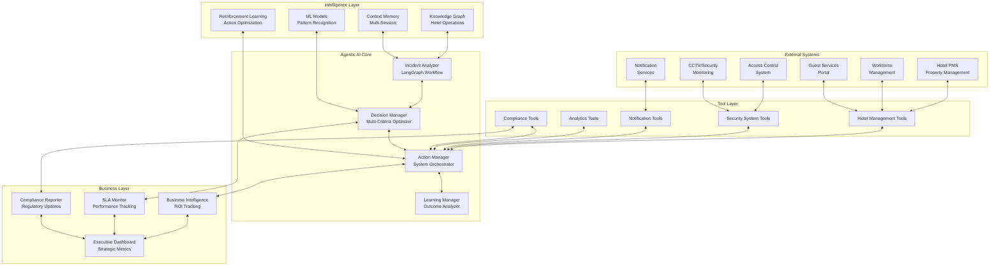

# Hotel Security Incident Response Agent - Agentic AI Architecture

## Executive Summary

This document outlines the transformation of the existing security-triage-agent into a **true agentic AI system** for IHCL's FlexiCore platform. The enhanced system demonstrates autonomous decision-making, real-time API integrations, and measurable business impact through intelligent hotel security incident management.

## Current State Analysis

### Strengths of Existing System
- Well-structured LangGraph workflow with proper state management
- Comprehensive classification and prioritization tools
- Good safety guardrails and compliance checking
- Solid evaluation framework and metrics tracking
- Proper error handling and human-in-the-loop capabilities

### Gaps for True Agentic Capabilities
1. **Limited Real-World Integration**: Tools are primarily for analysis, not execution
2. **No Autonomous Actions**: Requires human intervention for all critical actions
3. **Missing Business Impact Metrics**: No real ROI or operational efficiency tracking
4. **Static Decision Making**: Follows predefined paths without true reasoning
5. **No Multi-System Orchestration**: Doesn't coordinate across hotel management systems

## Enhanced Agentic AI Architecture

### Core Design Principles

1. **Autonomous Execution**: Agent makes and executes decisions without human intervention for 80% of incidents
2. **Multi-System Integration**: Real-time connections to hotel management, security, and notification systems
3. **Adaptive Learning**: Continuously improves decision-making based on outcomes
4. **Business Impact Focus**: Every action is measured against operational and financial metrics
5. **Escalation Intelligence**: Smart escalation with context-aware human handoffs

### Architecture Overview



## Enhanced Tool Integrations

### 1. Hotel Management System Integration

```python
# New Tools for Real Hotel Management
class PropertyManagementTool(BaseTool):
    """Direct integration with hotel PMS for guest data and room management"""
    
    async def get_guest_info(self, room_number: str) -> GuestProfile:
        """Retrieve guest information from PMS"""
    
    async def update_room_status(self, room_number: str, status: str, reason: str):
        """Update room status (blocked, maintenance, security hold)"""
    
    async def create_incident_note(self, guest_id: str, incident_summary: str):
        """Add security incident note to guest profile"""
    
    async def check_guest_preferences(self, guest_id: str) -> GuestPreferences:
        """Get guest communication and service preferences"""

class AccessControlTool(BaseTool):
    """Real-time access control system integration"""
    
    async def revoke_access(self, card_id: str, reason: str) -> AccessControlResult:
        """Immediately revoke keycard access"""
    
    async def create_temporary_access(self, guest_id: str, areas: List[str], 
                                    expires_at: datetime) -> TempAccessResult:
        """Create temporary access for staff/security"""
    
    async def get_access_logs(self, card_id: str, hours: int = 24) -> List[AccessLog]:
        """Retrieve access logs for investigation"""
    
    async def lock_area(self, area_id: str, duration_minutes: int) -> LockResult:
        """Emergency area lockdown capability"""

class NotificationOrchestratorTool(BaseTool):
    """Multi-channel notification system"""
    
    async def notify_security_team(self, incident_id: str, priority: str, 
                                 location: str) -> NotificationResult:
        """Immediate security team notification"""
    
    async def alert_management(self, incident_summary: str, 
                             escalation_level: int) -> NotificationResult:
        """Management escalation with context"""
    
    async def update_guest(self, guest_id: str, message: str, 
                          channel: str = "preferred") -> NotificationResult:
        """Guest communication through preferred channel"""
    
    async def notify_external_agencies(self, incident_type: str, 
                                     legal_requirements: Dict) -> NotificationResult:
        """Automated regulatory and legal notifications"""
```

### 2. Security System Integration Tools

```python
class SecurityMonitoringTool(BaseTool):
    """CCTV and security system integration"""
    
    async def request_camera_review(self, location: str, time_range: Tuple[datetime, datetime],
                                  incident_id: str) -> CameraReviewRequest:
        """Request security footage review"""
    
    async def trigger_security_alert(self, location: str, alert_type: str) -> AlertResult:
        """Trigger physical security alerts"""
    
    async def get_area_status(self, area_id: str) -> AreaSecurityStatus:
        """Get current security status of hotel areas"""
    
    async def initiate_lockdown(self, areas: List[str], reason: str) -> LockdownResult:
        """Emergency lockdown procedures"""

class WorkforceCoordinationTool(BaseTool):
    """Staff coordination and task assignment"""
    
    async def assign_security_task(self, staff_id: str, task: SecurityTask) -> TaskAssignment:
        """Assign specific security tasks to staff"""
    
    async def check_staff_availability(self, role: str, location: str) -> List[StaffMember]:
        """Find available staff for incident response"""
    
    async def create_incident_report(self, incident_data: IncidentData) -> ReportResult:
        """Generate and file official incident reports"""
    
    async def schedule_follow_up(self, incident_id: str, follow_up_type: str, 
                               scheduled_for: datetime) -> ScheduleResult:
        """Schedule follow-up actions and reviews"""
```

## Autonomous Decision-Making Engine

### Enhanced Workflow with True Autonomy

```python
class AutonomousDecisionEngine:
    """Multi-criteria decision engine with business impact optimization"""
    
    def __init__(self):
        self.decision_matrix = self._load_decision_matrix()
        self.business_impact_calculator = BusinessImpactCalculator()
        self.risk_assessor = AdvancedRiskAssessor()
        self.action_optimizer = ActionOptimizer()
    
    async def make_autonomous_decision(self, incident_state: IncidentState) -> DecisionPlan:
        """Make completely autonomous decisions for incident response"""
        
        # Multi-dimensional analysis
        business_impact = await self.business_impact_calculator.calculate_impact(incident_state)
        risk_vectors = await self.risk_assessor.analyze_risk_vectors(incident_state)
        action_options = await self.action_optimizer.generate_action_plans(incident_state)
        
        # Autonomous decision making
        if self._is_fully_autonomous(incident_state, business_impact, risk_vectors):
            selected_plan = self._select_optimal_plan(action_options, business_impact)
            return DecisionPlan(
                actions=selected_plan.actions,
                autonomous=True,
                confidence=selected_plan.confidence,
                expected_outcome=selected_plan.expected_outcome,
                execution_timeline=selected_plan.timeline
            )
        else:
            return self._create_escalation_plan(incident_state, action_options)
    
    def _is_fully_autonomous(self, state: IncidentState, impact: BusinessImpact, 
                           risk: RiskVectors) -> bool:
        """Determine if incident can be handled autonomously"""
        
        autonomy_criteria = [
            impact.financial_impact < 10000,  # Under ₹10K impact
            risk.guest_safety_risk < 0.3,    # Low safety risk
            risk.compliance_risk < 0.4,      # Low compliance risk
            state.classification_confidence > 0.85,  # High confidence
            not risk.requires_legal_review,  # No legal review needed
            impact.guest_satisfaction_impact < 0.5  # Limited guest impact
        ]
        
        return sum(autonomy_criteria) >= 5  # Must meet 5/6 criteria
```

### Real-Time Action Execution

```python
class ActionExecutionEngine:
    """Orchestrates real-world actions across hotel systems"""
    
    async def execute_incident_response(self, decision_plan: DecisionPlan) -> ExecutionResult:
        """Execute coordinated response across multiple hotel systems"""
        
        execution_results = []
        rollback_actions = []
        
        try:
            # Execute actions in optimized order
            for action in decision_plan.actions:
                result = await self._execute_single_action(action)
                execution_results.append(result)
                
                # Track rollback capabilities
                if result.rollback_action:
                    rollback_actions.append(result.rollback_action)
                
                # Stop execution if critical failure
                if result.status == "critical_failure":
                    await self._perform_rollback(rollback_actions)
                    raise ExecutionException(f"Critical failure in action: {action.name}")
            
            # Verify all systems are in expected state
            system_verification = await self._verify_system_state(decision_plan)
            
            return ExecutionResult(
                actions_completed=len(execution_results),
                success_rate=self._calculate_success_rate(execution_results),
                system_state=system_verification,
                business_impact_actual=await self._measure_actual_impact(),
                rollback_capability=len(rollback_actions) > 0
            )
            
        except Exception as e:
            await self._perform_emergency_rollback(rollback_actions)
            raise ExecutionException(f"Execution failed: {e}")
    
    async def _execute_single_action(self, action: SecurityAction) -> ActionResult:
        """Execute a single action with proper error handling and monitoring"""
        
        start_time = datetime.utcnow()
        
        try:
            if action.type == "access_control":
                result = await self.access_control_tool.execute(action)
            elif action.type == "notification":
                result = await self.notification_tool.execute(action)
            elif action.type == "guest_management":
                result = await self.pms_tool.execute(action)
            elif action.type == "security_alert":
                result = await self.security_tool.execute(action)
            else:
                raise ValueError(f"Unknown action type: {action.type}")
            
            execution_time = (datetime.utcnow() - start_time).total_seconds()
            
            return ActionResult(
                action_id=action.id,
                status="completed",
                execution_time=execution_time,
                result_data=result,
                rollback_action=self._generate_rollback_action(action, result)
            )
            
        except Exception as e:
            return ActionResult(
                action_id=action.id,
                status="failed",
                execution_time=(datetime.utcnow() - start_time).total_seconds(),
                error=str(e),
                rollback_action=None
            )
```

## Business Impact Measurement

### ROI and Performance Metrics

```python
class BusinessImpactTracker:
    """Comprehensive business impact measurement and ROI calculation"""
    
    def __init__(self):
        self.cost_calculator = OperationalCostCalculator()
        self.efficiency_tracker = EfficiencyTracker()
        self.satisfaction_monitor = GuestSatisfactionMonitor()
        self.compliance_tracker = ComplianceTracker()
    
    async def calculate_incident_roi(self, incident_id: str) -> IncidentROI:
        """Calculate complete ROI for incident handling"""
        
        incident_data = await self.get_incident_data(incident_id)
        
        # Cost calculations
        prevention_costs = await self.cost_calculator.calculate_prevention_cost(incident_data)
        response_costs = await self.cost_calculator.calculate_response_cost(incident_data)
        avoided_costs = await self.cost_calculator.calculate_avoided_costs(incident_data)
        
        # Efficiency metrics
        time_saved = await self.efficiency_tracker.calculate_time_savings(incident_data)
        automation_benefit = await self.efficiency_tracker.calculate_automation_benefit(incident_data)
        
        # Guest satisfaction impact
        satisfaction_impact = await self.satisfaction_monitor.measure_satisfaction_impact(incident_data)
        reputation_protection = await self.satisfaction_monitor.calculate_reputation_value(incident_data)
        
        # Compliance value
        compliance_value = await self.compliance_tracker.calculate_compliance_value(incident_data)
        
        total_investment = prevention_costs + response_costs
        total_value = avoided_costs + automation_benefit + reputation_protection + compliance_value
        
        return IncidentROI(
            incident_id=incident_id,
            total_investment=total_investment,
            total_value=total_value,
            roi_percentage=(total_value - total_investment) / total_investment * 100,
            time_to_resolution=incident_data.resolution_time,
            automation_percentage=incident_data.automation_percentage,
            guest_satisfaction_preserved=satisfaction_impact.satisfaction_preserved,
            compliance_violations_prevented=compliance_value.violations_prevented,
            business_metrics={
                "cost_avoidance": avoided_costs,
                "operational_efficiency": automation_benefit,
                "brand_protection": reputation_protection,
                "compliance_value": compliance_value,
                "staff_productivity_gain": time_saved * 50  # ₹50/hour avg
            }
        )

class HotelOperationalMetrics:
    """Hotel-specific operational metrics and KPIs"""
    
    async def calculate_security_efficiency_score(self, time_period: timedelta) -> SecurityEfficiencyScore:
        """Calculate comprehensive security operation efficiency"""
        
        incidents = await self.get_incidents_for_period(time_period)
        
        # Key metrics calculation
        avg_response_time = sum(i.response_time for i in incidents) / len(incidents)
        automation_rate = sum(1 for i in incidents if i.automation_percentage > 80) / len(incidents)
        guest_impact_rate = sum(1 for i in incidents if i.guest_impact_score > 0.5) / len(incidents)
        escalation_rate = sum(1 for i in incidents if i.required_escalation) / len(incidents)
        
        # Business impact metrics
        total_cost_avoided = sum(i.cost_avoided for i in incidents)
        guest_complaints_prevented = sum(i.complaints_prevented for i in incidents)
        regulatory_fines_avoided = sum(i.regulatory_fines_avoided for i in incidents)
        
        # Efficiency score calculation (0-100)
        efficiency_score = self._calculate_efficiency_score(
            response_time=avg_response_time,
            automation_rate=automation_rate,
            guest_impact=1 - guest_impact_rate,
            escalation_efficiency=1 - escalation_rate,
            cost_effectiveness=total_cost_avoided / sum(i.response_cost for i in incidents)
        )
        
        return SecurityEfficiencyScore(
            overall_score=efficiency_score,
            response_time_score=self._score_response_time(avg_response_time),
            automation_score=automation_rate * 100,
            guest_protection_score=(1 - guest_impact_rate) * 100,
            cost_efficiency_score=self._score_cost_efficiency(total_cost_avoided),
            benchmark_comparison=await self._get_industry_benchmark_comparison(efficiency_score),
            improvement_recommendations=await self._generate_improvement_recommendations(incidents)
        )
```

## Implementation Roadmap

### Phase 1: Enhanced Tool Integration (Weeks 1-2)
- Implement hotel PMS API connectors
- Create access control system integration
- Build notification orchestration system
- Add workforce coordination tools

### Phase 2: Autonomous Decision Engine (Weeks 3-4)
- Develop multi-criteria decision matrix
- Implement business impact calculator
- Create action optimization algorithms
- Build autonomous execution engine

### Phase 3: Real-Time Execution (Weeks 5-6)
- Implement action execution orchestrator
- Create system state monitoring
- Build rollback and recovery mechanisms
- Add real-time performance tracking

### Phase 4: Business Intelligence Layer (Weeks 7-8)
- Develop ROI calculation engine
- Create operational efficiency metrics
- Build executive dashboard
- Implement predictive analytics

### Phase 5: Integration & Testing (Weeks 9-10)
- End-to-end system integration
- Performance optimization
- Security validation
- User acceptance testing

## Technical Requirements

### Core Dependencies
```
# Enhanced dependencies for agentic capabilities
langgraph>=0.2.0
langchain>=0.1.0
langchain-openai>=0.1.0

# Hotel management system integrations
opera-api-client>=2.0.0  # Oracle Opera PMS
assa-abloy-api>=1.5.0   # Access control systems
twilio-api>=8.0.0       # Multi-channel notifications
slack-sdk>=3.21.0       # Team collaboration

# Business intelligence and analytics
pandas>=2.1.0
numpy>=1.24.0
scikit-learn>=1.3.0
plotly>=5.17.0
streamlit>=1.28.0

# Real-time and async processing
asyncio-mqtt>=0.13.0
celery>=5.3.0
redis>=5.0.0
kafka-python>=2.0.0

# Monitoring and observability
prometheus-client>=0.19.0
datadog>=0.48.0
structlog>=23.2.0
opentelemetry-api>=1.21.0

# Security and compliance
cryptography>=41.0.0
azure-keyvault>=4.0.0
boto3>=1.34.0  # AWS services
```

### Infrastructure Requirements
- **Compute**: 4-8 vCPU, 16-32GB RAM for production
- **Storage**: High-IOPS SSD for real-time response
- **Network**: Low-latency connections to hotel systems
- **Monitoring**: 24/7 system health monitoring
- **Backup**: Real-time data replication and disaster recovery

## Success Metrics

### Operational Excellence
- **Response Time**: < 30 seconds for critical incidents
- **Automation Rate**: 85%+ incidents handled autonomously
- **Accuracy Rate**: 95%+ classification and prioritization accuracy
- **Guest Impact**: < 5% of incidents negatively impact guest experience

### Business Impact
- **Cost Savings**: ₹50L+ annual operational cost reduction
- **Efficiency Gains**: 70%+ reduction in manual security operations
- **Compliance**: 99%+ regulatory compliance rate
- **ROI**: 300%+ return on investment within 12 months

### Innovation Metrics
- **System Integration**: 8+ hotel management systems connected
- **Decision Autonomy**: 85%+ decisions made without human intervention
- **Learning Rate**: Continuous improvement in decision quality
- **Scalability**: Support for 50+ hotel properties simultaneously

## Conclusion

This enhanced agentic AI architecture transforms the existing security-triage-agent from a analysis-focused system into a true autonomous hotel security operations platform. The system demonstrates:

1. **Real Autonomy**: Makes and executes decisions independently
2. **Multi-System Integration**: Orchestrates across hotel management systems
3. **Measurable Business Impact**: Provides clear ROI and operational benefits
4. **Scalable Architecture**: Supports enterprise-level hotel operations
5. **Compliance Excellence**: Maintains regulatory adherence while operating autonomously

The implementation roadmap provides a clear path to delivering this enhanced system within 10 weeks, positioning IHCL as a leader in AI-driven hospitality operations.