# IHCL FlexiCore - Agentic Security Deployment Architecture

## Executive Summary

This document outlines the comprehensive deployment architecture for the enhanced Hotel Security Incident Response Agent within IHCL's FlexiCore ecosystem. The deployment strategy focuses on seamless integration, scalability, and measurable business impact delivery.

## Deployment Architecture Overview

```mermaid
graph TB
    subgraph "IHCL FlexiCore Cloud Infrastructure"
        subgraph "Load Balancer Layer"
            ALB[Application Load Balancer<br/>AWS ALB / Azure Front Door]
            WAF[Web Application Firewall<br/>DDoS Protection]
        end
        
        subgraph "API Gateway Layer"
            APIGW[API Gateway<br/>Rate Limiting & Authentication]
            CACHE[Redis Cache<br/>Session & Response Caching]
        end
        
        subgraph "Agentic AI Core Services"
            AGT1[Security Agent Instance 1<br/>Primary Processing]
            AGT2[Security Agent Instance 2<br/>Backup & Load Sharing]
            AGT3[Security Agent Instance 3<br/>Specialized Processing]
            
            DEC[Decision Engine<br/>Autonomous Decision Making]
            EXE[Execution Engine<br/>Multi-System Orchestration]
            MON[Monitoring Service<br/>Real-time Performance]
        end
        
        subgraph "Integration Layer"
            ESB[Enterprise Service Bus<br/>System Integration Hub]
            
            subgraph "Hotel Management Adapters"
                PMS_ADAPTER[PMS Adapter<br/>Opera/Fidelio Integration]
                ACS_ADAPTER[Access Control Adapter<br/>ASSA ABLOY/Salto]
                CCTV_ADAPTER[CCTV Adapter<br/>Video Management Systems]
                WFM_ADAPTER[Workforce Adapter<br/>Staff Management]
            end
        end
        
        subgraph "Data & Analytics Layer"
            OLTP[Operational Database<br/>PostgreSQL Cluster]
            OLAP[Analytics Warehouse<br/>Snowflake/BigQuery]
            
            ML_PLATFORM[ML Platform<br/>Model Training & Inference]
            BI_ENGINE[BI Engine<br/>Real-time Dashboards]
        end
        
        subgraph "Security & Compliance"
            VAULT[HashiCorp Vault<br/>Secrets Management]
            AUDIT[Audit Logging<br/>Compliance Tracking]
            SIEM[SIEM Integration<br/>Security Monitoring]
        end
    end
    
    subgraph "Hotel Property Systems"
        subgraph "Taj Mumbai (Primary Pilot)"
            PMS_TAJ[Opera PMS<br/>Property Management]
            ACS_TAJ[ASSA ABLOY VingCard<br/>Access Control]
            CCTV_TAJ[Milestone XProtect<br/>Video Surveillance]
            WFM_TAJ[Kronos Workforce<br/>Staff Scheduling]
            GUEST_TAJ[Guest Services Portal<br/>Customer Interface]
        end
        
        subgraph "Additional Properties"
            PROP2[Taj Delhi]
            PROP3[Taj Bangalore] 
            PROP4[Vivanta Mumbai]
        end
    end
    
    subgraph "External Services"
        NOTIFY[Notification Services<br/>Twilio, SendGrid, Slack]
        COMPLIANCE[Regulatory Services<br/>DPDP, PCI DSS Reporting]
        BACKUP[Backup & DR<br/>Multi-region Replication]
    end
    
    ALB --> APIGW
    WAF --> ALB
    APIGW --> AGT1
    APIGW --> AGT2
    APIGW --> AGT3
    CACHE --> APIGW
    
    AGT1 --> DEC
    AGT2 --> DEC
    AGT3 --> DEC
    DEC --> EXE
    EXE --> MON
    
    EXE --> ESB
    ESB --> PMS_ADAPTER
    ESB --> ACS_ADAPTER
    ESB --> CCTV_ADAPTER
    ESB --> WFM_ADAPTER
    
    PMS_ADAPTER --> PMS_TAJ
    ACS_ADAPTER --> ACS_TAJ
    CCTV_ADAPTER --> CCTV_TAJ
    WFM_ADAPTER --> WFM_TAJ
    
    AGT1 --> OLTP
    AGT2 --> OLTP
    AGT3 --> OLTP
    OLTP --> OLAP
    OLAP --> BI_ENGINE
    
    DEC --> ML_PLATFORM
    ML_PLATFORM --> DEC
    
    EXE --> VAULT
    MON --> AUDIT
    AUDIT --> SIEM
    
    EXE --> NOTIFY
    AGT1 --> COMPLIANCE
    
    OLAP --> BACKUP
    PROP2 --> ESB
    PROP3 --> ESB
    PROP4 --> ESB
```



## Phase-wise Deployment Strategy

### Phase 1: Foundation Setup (Weeks 1-2)
**Infrastructure Provisioning**

#### Cloud Infrastructure Setup
```yaml
# Infrastructure as Code - Terraform Configuration
resource "aws_eks_cluster" "ihcl_flexicore_security" {
  name     = "ihcl-flexicore-security-agent"
  role_arn = aws_iam_role.cluster_role.arn
  version  = "1.28"

  vpc_config {
    subnet_ids              = var.private_subnet_ids
    endpoint_private_access = true
    endpoint_public_access  = false
    security_group_ids     = [aws_security_group.cluster_sg.id]
  }

  enabled_cluster_log_types = ["api", "audit", "authenticator", "controllerManager", "scheduler"]

  tags = {
    Environment = "production"
    Project     = "IHCL-FlexiCore-Security"
    Team        = "Security-AI"
  }
}

resource "aws_rds_cluster" "operational_db" {
  cluster_identifier      = "ihcl-security-operational-db"
  engine                 = "aurora-postgresql"
  engine_version         = "15.4"
  database_name          = "security_operations"
  master_username        = "security_admin"
  manage_master_user_password = true
  
  backup_retention_period = 30
  preferred_backup_window = "03:00-05:00"
  
  vpc_security_group_ids = [aws_security_group.db_sg.id]
  db_subnet_group_name   = aws_db_subnet_group.main.name
  
  enabled_cloudwatch_logs_exports = ["postgresql"]
  
  tags = {
    Environment = "production"
    Application = "security-agent"
  }
}

resource "aws_elasticache_replication_group" "session_cache" {
  replication_group_id       = "ihcl-security-cache"
  description               = "Security agent session and response cache"
  
  num_cache_clusters         = 3
  node_type                 = "cache.r7g.large"
  port                      = 6379
  parameter_group_name      = "default.redis7"
  
  subnet_group_name         = aws_elasticache_subnet_group.main.name
  security_group_ids        = [aws_security_group.cache_sg.id]
  
  multi_az_enabled          = true
  automatic_failover_enabled = true
  
  tags = {
    Environment = "production"
    Application = "security-agent"
  }
}
```

#### Kubernetes Deployment Configuration
```yaml
# Kubernetes Deployment for Security Agent
apiVersion: apps/v1
kind: Deployment
metadata:
  name: security-agent-deployment
  namespace: ihcl-security
spec:
  replicas: 3
  selector:
    matchLabels:
      app: security-agent
  template:
    metadata:
      labels:
        app: security-agent
    spec:
      containers:
      - name: security-agent
        image: ihcl/security-agent:v2.0.0
        ports:
        - containerPort: 8080
        env:
        - name: DATABASE_URL
          valueFrom:
            secretKeyRef:
              name: db-secrets
              key: database-url
        - name: REDIS_URL
          valueFrom:
            secretKeyRef:
              name: cache-secrets
              key: redis-url
        - name: OPENAI_API_KEY
          valueFrom:
            secretKeyRef:
              name: ai-secrets
              key: openai-key
        resources:
          requests:
            memory: "2Gi"
            cpu: "1000m"
          limits:
            memory: "4Gi"
            cpu: "2000m"
        livenessProbe:
          httpGet:
            path: /health
            port: 8080
          initialDelaySeconds: 30
          periodSeconds: 10
        readinessProbe:
          httpGet:
            path: /ready
            port: 8080
          initialDelaySeconds: 5
          periodSeconds: 5

---
apiVersion: v1
kind: Service
metadata:
  name: security-agent-service
  namespace: ihcl-security
spec:
  selector:
    app: security-agent
  ports:
  - protocol: TCP
    port: 80
    targetPort: 8080
  type: ClusterIP

---
apiVersion: networking.k8s.io/v1
kind: Ingress
metadata:
  name: security-agent-ingress
  namespace: ihcl-security
  annotations:
    nginx.ingress.kubernetes.io/rewrite-target: /
    cert-manager.io/cluster-issuer: "letsencrypt-prod"
spec:
  tls:
  - hosts:
    - security-api.flexicore.ihcl.com
    secretName: security-api-tls
  rules:
  - host: security-api.flexicore.ihcl.com
    http:
      paths:
      - path: /
        pathType: Prefix
        backend:
          service:
            name: security-agent-service
            port:
              number: 80
```

### Phase 2: Hotel System Integration (Weeks 3-4)
**PMS and Access Control Integration**

#### Opera PMS Integration
```python
# Opera PMS Integration Configuration
class OperaPMSIntegration:
    def __init__(self, config):
        self.base_url = config['opera_api_url']
        self.auth_token = config['opera_auth_token']
        self.property_code = config['property_code']
        
        # Connection pooling for high-performance
        self.session = aiohttp.ClientSession(
            connector=aiohttp.TCPConnector(limit=100, ttl_dns_cache=300),
            timeout=aiohttp.ClientTimeout(total=30)
        )
    
    async def get_guest_profile(self, room_number: str) -> Optional[GuestProfile]:
        """Retrieve guest profile from Opera PMS"""
        
        endpoint = f"{self.base_url}/v1/hotels/{self.property_code}/reservations"
        params = {
            'roomNumber': room_number,
            'includeProfile': True,
            'includePreferences': True
        }
        
        headers = {
            'Authorization': f'Bearer {self.auth_token}',
            'Content-Type': 'application/json',
            'x-hotelid': self.property_code
        }
        
        try:
            async with self.session.get(endpoint, params=params, headers=headers) as response:
                if response.status == 200:
                    data = await response.json()
                    return self._transform_opera_to_guest_profile(data)
                else:
                    logger.error(f"Opera PMS API error: {response.status}")
                    return None
                    
        except Exception as e:
            logger.error(f"Opera PMS connection error: {e}")
            return None
    
    async def update_room_status(self, room_number: str, status: str, reason: str) -> bool:
        """Update room status in Opera PMS"""
        
        endpoint = f"{self.base_url}/v1/hotels/{self.property_code}/rooms/{room_number}/status"
        
        payload = {
            'roomStatus': status,
            'reason': reason,
            'updatedBy': 'SECURITY_AGENT',
            'timestamp': datetime.utcnow().isoformat()
        }
        
        try:
            async with self.session.put(endpoint, json=payload, headers=headers) as response:
                return response.status == 200
                
        except Exception as e:
            logger.error(f"Error updating room status: {e}")
            return False

# Integration Test Suite
class TestOperaIntegration:
    @pytest.mark.asyncio
    async def test_guest_profile_retrieval(self):
        opera = OperaPMSIntegration(test_config)
        profile = await opera.get_guest_profile("1205")
        
        assert profile is not None
        assert profile.room_number == "1205"
        assert profile.guest_id is not None
        
    @pytest.mark.asyncio  
    async def test_room_status_update(self):
        opera = OperaPMSIntegration(test_config)
        success = await opera.update_room_status("1205", "SECURITY_HOLD", "Security incident investigation")
        
        assert success is True
```

#### ASSA ABLOY Access Control Integration
```python
class AssaAbloyAccessControl:
    """Integration with ASSA ABLOY VingCard access control system"""
    
    def __init__(self, config):
        self.controller_ip = config['controller_ip']
        self.api_key = config['api_key']
        self.property_id = config['property_id']
    
    async def revoke_card_access(self, card_id: str, reason: str) -> AccessControlResult:
        """Immediately revoke keycard access"""
        
        command = {
            'action': 'REVOKE_ACCESS',
            'cardId': card_id,
            'propertyId': self.property_id,
            'reason': reason,
            'timestamp': datetime.utcnow().isoformat(),
            'revokedBy': 'SECURITY_AGENT'
        }
        
        try:
            # Connect to ASSA ABLOY controller via TCP socket
            reader, writer = await asyncio.open_connection(self.controller_ip, 4001)
            
            # Send command
            writer.write(json.dumps(command).encode())
            await writer.drain()
            
            # Read response
            response_data = await reader.read(1024)
            response = json.loads(response_data.decode())
            
            writer.close()
            await writer.wait_closed()
            
            if response['status'] == 'SUCCESS':
                return AccessControlResult(
                    success=True,
                    action='revoke',
                    card_id=card_id,
                    timestamp=datetime.utcnow(),
                    affected_areas=response.get('affectedAreas', []),
                    rollback_token=response.get('rollbackToken')
                )
            else:
                return AccessControlResult(
                    success=False,
                    action='revoke',
                    card_id=card_id,
                    timestamp=datetime.utcnow()
                )
                
        except Exception as e:
            logger.error(f"ASSA ABLOY access control error: {e}")
            return AccessControlResult(
                success=False,
                action='revoke',
                card_id=card_id,
                timestamp=datetime.utcnow()
            )
    
    async def create_emergency_access(self, staff_id: str, areas: List[str], 
                                    duration_hours: int = 2) -> AccessControlResult:
        """Create emergency access for security staff"""
        
        command = {
            'action': 'CREATE_EMERGENCY_ACCESS',
            'staffId': staff_id,
            'areas': areas,
            'durationHours': duration_hours,
            'propertyId': self.property_id,
            'createdBy': 'SECURITY_AGENT',
            'timestamp': datetime.utcnow().isoformat()
        }
        
        # Implementation similar to revoke_card_access
        # Returns AccessControlResult with temporary access details
        pass
```

### Phase 3: Autonomous Operations (Weeks 5-6)
**Decision Engine and Execution Orchestrator**

#### Deployment Configuration for Decision Engine
```yaml
apiVersion: apps/v1
kind: Deployment
metadata:
  name: decision-engine
  namespace: ihcl-security
spec:
  replicas: 2
  selector:
    matchLabels:
      app: decision-engine
  template:
    metadata:
      labels:
        app: decision-engine
    spec:
      containers:
      - name: decision-engine
        image: ihcl/decision-engine:v1.0.0
        ports:
        - containerPort: 8081
        env:
        - name: ML_MODEL_ENDPOINT
          value: "http://ml-platform-service:8080/predict"
        - name: RISK_THRESHOLD_CONFIG
          valueFrom:
            configMapKeyRef:
              name: decision-config
              key: risk-thresholds
        resources:
          requests:
            memory: "4Gi"
            cpu: "2000m"
          limits:
            memory: "8Gi" 
            cpu: "4000m"
        volumeMounts:
        - name: model-cache
          mountPath: /app/models
      volumes:
      - name: model-cache
        emptyDir:
          sizeLimit: 10Gi

---
apiVersion: v1
kind: ConfigMap
metadata:
  name: decision-config
  namespace: ihcl-security
data:
  risk-thresholds: |
    {
      "guest_safety_max": 0.3,
      "financial_impact_max": 50000,
      "autonomy_confidence_min": 0.75,
      "escalation_thresholds": {
        "management": 0.6,
        "legal": 0.8,
        "executive": 0.9
      }
    }
```

#### Monitoring and Alerting Setup
```yaml
apiVersion: monitoring.coreos.com/v1
kind: ServiceMonitor
metadata:
  name: security-agent-metrics
  namespace: ihcl-security
spec:
  selector:
    matchLabels:
      app: security-agent
  endpoints:
  - port: metrics
    interval: 30s
    path: /metrics

---
apiVersion: monitoring.coreos.com/v1
kind: PrometheusRule
metadata:
  name: security-agent-alerts
  namespace: ihcl-security
spec:
  groups:
  - name: security-agent.rules
    rules:
    - alert: SecurityAgentDown
      expr: up{job="security-agent"} == 0
      for: 5m
      labels:
        severity: critical
      annotations:
        summary: "Security Agent is down"
        description: "Security Agent has been down for more than 5 minutes"
        
    - alert: HighIncidentResponseTime
      expr: security_incident_response_time_seconds > 300
      for: 2m
      labels:
        severity: warning
      annotations:
        summary: "High incident response time"
        description: "Security incident response time is above 5 minutes"
        
    - alert: LowAutonomyRate
      expr: security_autonomy_rate < 0.7
      for: 10m
      labels:
        severity: warning
      annotations:
        summary: "Low autonomy rate detected"
        description: "Security agent autonomy rate has dropped below 70%"

---
apiVersion: v1
kind: Service
metadata:
  name: alertmanager-slack-webhook
  namespace: ihcl-security
spec:
  selector:
    app: alertmanager-webhook
  ports:
  - port: 9093
    targetPort: 9093
```

### Phase 4: Business Intelligence Integration (Weeks 7-8)
**Analytics and Executive Dashboard**

#### Real-time Dashboard Configuration
```python
# Streamlit Executive Dashboard
import streamlit as st
import plotly.express as px
import plotly.graph_objects as go
from datetime import datetime, timedelta

class SecurityExecutiveDashboard:
    def __init__(self):
        self.business_tracker = BusinessImpactTracker(config)
        
    def render_executive_summary(self):
        """Render executive-level KPI summary"""
        
        st.title("🛡️ IHCL FlexiCore - Security Operations Executive Dashboard")
        
        # Date range selector
        col1, col2 = st.columns(2)
        with col1:
            start_date = st.date_input("Start Date", datetime.now() - timedelta(days=30))
        with col2:
            end_date = st.date_input("End Date", datetime.now())
        
        # Fetch metrics
        metrics = asyncio.run(self.business_tracker.generate_executive_dashboard_metrics(
            period_days=(end_date - start_date).days
        ))
        
        # Executive Summary Cards
        st.header("📊 Executive Summary")
        
        col1, col2, col3, col4 = st.columns(4)
        
        with col1:
            st.metric(
                label="Total ROI",
                value=f"{metrics['executive_summary']['total_roi_percentage']:.1f}%",
                delta=f"+{metrics['executive_summary']['total_roi_percentage'] - 250:.1f}% vs target"
            )
            
        with col2:
            st.metric(
                label="Cost Savings",
                value=f"₹{metrics['executive_summary']['total_cost_savings_inr']:,.0f}",
                delta=f"₹{metrics['business_value_delivered']['annual_cost_savings_projection']:,.0f} annual projection"
            )
            
        with col3:
            st.metric(
                label="Automation Rate",
                value=f"{metrics['key_performance_indicators']['automation_rate_percentage']:.1f}%",
                delta=f"+{metrics['key_performance_indicators']['automation_rate_percentage'] - 70:.1f}% vs target"
            )
            
        with col4:
            st.metric(
                label="Avg Response Time",
                value=f"{metrics['key_performance_indicators']['average_response_time_minutes']:.1f} min",
                delta=f"-{45 - metrics['key_performance_indicators']['average_response_time_minutes']:.1f} min vs manual"
            )
        
        # Performance Trends
        st.header("📈 Performance Trends")
        self.render_performance_charts(metrics)
        
        # Property Breakdown
        st.header("🏨 Property Performance")
        self.render_property_breakdown(metrics['property_breakdown'])
        
        # Strategic Insights
        st.header("💡 Strategic Insights")
        for insight in metrics['strategic_insights']:
            st.info(insight)
    
    def render_performance_charts(self, metrics):
        """Render performance trend charts"""
        
        # Create sample time series data for demo
        dates = pd.date_range(start='2024-01-01', periods=30, freq='D')
        
        # ROI Trend
        roi_data = np.random.normal(320, 50, 30)  # ROI around 320%
        
        fig_roi = px.line(
            x=dates, y=roi_data,
            title="ROI Trend Over Time",
            labels={'x': 'Date', 'y': 'ROI (%)'}
        )
        fig_roi.add_hline(y=300, line_dash="dash", line_color="green", 
                         annotation_text="Target ROI: 300%")
        
        st.plotly_chart(fig_roi, use_container_width=True)
        
        # Incident Volume and Automation Rate
        col1, col2 = st.columns(2)
        
        with col1:
            incident_volume = np.random.poisson(15, 30)  # ~15 incidents per day
            fig_volume = px.bar(
                x=dates[-7:], y=incident_volume[-7:],
                title="Daily Incident Volume (Last 7 Days)"
            )
            st.plotly_chart(fig_volume, use_container_width=True)
            
        with col2:
            automation_rate = np.random.normal(85, 5, 7)  # ~85% automation
            fig_auto = px.line(
                x=dates[-7:], y=automation_rate,
                title="Automation Rate (Last 7 Days)",
                labels={'y': 'Automation Rate (%)'}
            )
            fig_auto.add_hline(y=80, line_dash="dash", line_color="orange",
                              annotation_text="Target: 80%")
            st.plotly_chart(fig_auto, use_container_width=True)
    
    def render_property_breakdown(self, property_data):
        """Render property-wise performance breakdown"""
        
        property_df = pd.DataFrame([
            {
                'Property': prop['property_code'],
                'Incidents': prop['metrics']['incidents_count'],
                'ROI (%)': prop['metrics']['roi_percentage'],
                'Automation (%)': prop['metrics']['automation_rate'] * 100,
                'Cost Savings (₹)': prop['metrics']['cost_savings']
            }
            for prop in property_data
        ])
        
        # Property performance comparison
        fig = go.Figure()
        
        fig.add_trace(go.Scatter(
            x=property_df['Automation (%)'],
            y=property_df['ROI (%)'],
            mode='markers+text',
            text=property_df['Property'],
            textposition="top center",
            marker=dict(
                size=property_df['Cost Savings (₹)'] / 1000,  # Size by cost savings
                color=property_df['Incidents'],
                colorscale='Viridis',
                showscale=True,
                colorbar=dict(title="Incident Count")
            ),
            name="Properties"
        ))
        
        fig.update_layout(
            title="Property Performance Matrix",
            xaxis_title="Automation Rate (%)",
            yaxis_title="ROI (%)",
            showlegend=False
        )
        
        st.plotly_chart(fig, use_container_width=True)
        
        # Property table
        st.dataframe(property_df, use_container_width=True)

# Launch dashboard
if __name__ == "__main__":
    dashboard = SecurityExecutiveDashboard()
    dashboard.render_executive_summary()
```

### Phase 5: Production Deployment (Weeks 9-10)
**Go-Live and Performance Optimization**

#### Production Checklist
```yaml
# Production Deployment Checklist
production_readiness:
  infrastructure:
    - ✅ Multi-AZ deployment configured
    - ✅ Auto-scaling policies defined
    - ✅ Load balancer health checks enabled
    - ✅ SSL certificates installed and validated
    - ✅ Network security groups configured
    - ✅ Backup and disaster recovery tested
    
  security:
    - ✅ Secrets management with HashiCorp Vault
    - ✅ API authentication and authorization
    - ✅ Network encryption (TLS 1.3)
    - ✅ Audit logging enabled
    - ✅ OWASP security scan completed
    - ✅ Penetration testing report cleared
    
  monitoring:
    - ✅ Prometheus metrics collection
    - ✅ Grafana dashboards configured
    - ✅ AlertManager rules defined
    - ✅ Log aggregation with ELK stack
    - ✅ APM tracing with Jaeger
    - ✅ Synthetic monitoring tests
    
  performance:
    - ✅ Load testing completed (1000 RPS)
    - ✅ Database query optimization
    - ✅ Caching strategy implemented
    - ✅ CDN configuration for static assets
    - ✅ API response time < 500ms (95th percentile)
    - ✅ System availability > 99.9%
    
  integration:
    - ✅ All hotel systems integration tested
    - ✅ Fallback mechanisms validated
    - ✅ Data synchronization verified
    - ✅ Error handling and retry logic tested
    - ✅ Circuit breaker patterns implemented
    - ✅ API versioning and compatibility
    
  compliance:
    - ✅ DPDP compliance audit completed
    - ✅ PCI DSS requirements validated
    - ✅ SOC 2 Type II controls implemented
    - ✅ Data retention policies configured
    - ✅ Privacy impact assessment completed
    - ✅ Regulatory reporting mechanisms tested
```

#### Performance Benchmarks and SLAs
```yaml
# Service Level Agreements
sla_targets:
  availability:
    system_uptime: 99.9%  # Max 43.8 minutes downtime per month
    api_availability: 99.95%
    database_availability: 99.99%
  
  performance:
    incident_response_time:
      critical: 30 seconds
      high: 2 minutes
      medium: 5 minutes
      low: 15 minutes
    
    api_response_times:
      p50: 200ms
      p95: 500ms
      p99: 1000ms
    
    throughput:
      incidents_per_hour: 1000
      concurrent_users: 500
      api_requests_per_second: 2000
  
  quality:
    classification_accuracy: 95%
    autonomy_rate: 85%
    false_positive_rate: <5%
    escalation_rate: <15%
  
  business:
    cost_per_incident: <₹500
    roi_target: >300%
    guest_satisfaction_preservation: >90%
    compliance_adherence: >98%

# Monitoring Alerts Configuration
alert_thresholds:
  critical:
    - system_down: 0 healthy instances
    - response_time: >5 seconds
    - error_rate: >5%
    - security_breach: any unauthorized access
  
  warning:
    - high_latency: p95 > 1 second
    - low_automation: <75% incidents autonomous
    - resource_usage: >80% CPU/Memory
    - integration_failure: >3 failed API calls/minute
```

## Integration Testing Strategy

### End-to-End Test Scenarios
```python
class E2EIntegrationTests:
    """Comprehensive end-to-end integration testing"""
    
    @pytest.mark.e2e
    async def test_guest_access_incident_full_workflow(self):
        """Test complete workflow for guest access incident"""
        
        # Step 1: Simulate incident detection
        incident_data = {
            'title': 'Unauthorized guest access after checkout',
            'description': 'Guest accessed room 1205 after 11 AM checkout',
            'metadata': {
                'property_code': 'IHCL_TAJ_MUMBAI_001',
                'location': 'Floor 12, Room 1205',
                'affected_systems': ['key_card_system'],
                'affected_guests': ['guest123@email.com']
            }
        }
        
        # Step 2: Submit incident to agent
        response = await self.security_agent.process_incident(**incident_data)
        
        # Step 3: Verify autonomous decision made
        assert response['autonomous'] == True
        assert response['confidence'] > 0.75
        
        # Step 4: Verify PMS integration - room status updated
        pms_status = await self.pms_client.get_room_status('1205')
        assert pms_status['status'] == 'SECURITY_HOLD'
        
        # Step 5: Verify access control - keycard revoked
        access_status = await self.access_control.check_card_status('card123')
        assert access_status['active'] == False
        
        # Step 6: Verify notifications sent
        notifications = await self.notification_service.get_sent_notifications()
        assert len(notifications) >= 2  # Security team + management
        
        # Step 7: Verify business metrics tracked
        roi_data = await self.business_tracker.get_incident_roi(response['incident_id'])
        assert roi_data['roi_percentage'] > 200
        
        # Step 8: Verify compliance documentation
        audit_log = await self.audit_service.get_incident_audit_log(response['incident_id'])
        assert audit_log['compliance_status'] == 'compliant'
    
    @pytest.mark.load
    async def test_system_load_performance(self):
        """Test system performance under load"""
        
        # Simulate 100 concurrent incidents
        tasks = []
        for i in range(100):
            incident = self.generate_random_incident(f"incident_{i}")
            task = asyncio.create_task(self.security_agent.process_incident(**incident))
            tasks.append(task)
        
        # Wait for all incidents to process
        start_time = time.time()
        results = await asyncio.gather(*tasks)
        end_time = time.time()
        
        # Verify performance targets
        total_time = end_time - start_time
        assert total_time < 60  # All 100 incidents processed within 60 seconds
        
        successful_results = [r for r in results if 'error' not in r]
        assert len(successful_results) >= 95  # 95% success rate minimum
        
        avg_response_time = sum(r.get('processing_time', 0) for r in successful_results) / len(successful_results)
        assert avg_response_time < 30  # Average response time under 30 seconds
```

## Security and Compliance Framework

### Data Protection and Privacy
```yaml
data_protection:
  encryption:
    at_rest: AES-256
    in_transit: TLS 1.3
    key_management: AWS KMS / Azure Key Vault
  
  data_classification:
    public: marketing materials, general policies
    internal: operational procedures, system logs
    confidential: guest information, incident reports
    restricted: financial data, employee records
  
  data_retention:
    incident_logs: 7 years
    guest_data: as per reservation + 5 years
    audit_trails: 10 years
    system_logs: 2 years
  
  privacy_controls:
    data_minimization: collect only necessary data
    purpose_limitation: use data only for security operations
    consent_management: guest consent for data processing
    right_to_erasure: automated data deletion capability
    data_portability: export guest data on request

compliance_frameworks:
  dpdp_act_2023:
    - data_protection_officer_assigned: true
    - privacy_impact_assessments: completed
    - breach_notification_procedures: automated
    - consent_management_system: implemented
    - data_localization: indian_servers_primary
  
  pci_dss:
    - secure_network: firewalls_and_encryption
    - protect_cardholder_data: tokenization
    - vulnerability_management: regular_scans
    - access_control: role_based_access
    - monitoring: continuous_monitoring
    - information_security: policies_and_procedures
  
  iso_27001:
    - information_security_policy: approved
    - risk_management: implemented
    - incident_management: automated
    - business_continuity: disaster_recovery_tested
    - supplier_security: vendor_assessments
```

## Success Metrics and KPIs

### Technical Performance Metrics
```yaml
technical_kpis:
  system_performance:
    - api_response_time_p95: <500ms
    - system_uptime: >99.9%
    - throughput: >1000 incidents/hour
    - error_rate: <1%
    - data_accuracy: >99%
  
  ai_performance:
    - classification_accuracy: >95%
    - decision_confidence: >0.8
    - false_positive_rate: <5%
    - learning_improvement: >2% monthly
    - model_drift_detection: automated
  
  integration_health:
    - api_success_rate: >99%
    - data_synchronization: real-time
    - system_compatibility: 100%
    - failover_time: <30 seconds
    - recovery_time_objective: <4 hours
```

### Business Impact Metrics
```yaml
business_kpis:
  operational_efficiency:
    - automation_rate: >85%
    - incident_resolution_time: <30 minutes (critical)
    - staff_productivity_improvement: >70%
    - cost_per_incident: <₹500
    - manual_intervention_rate: <15%
  
  financial_impact:
    - annual_cost_savings: >₹50 lakhs
    - roi: >300%
    - cost_avoidance: >₹2 crores annually
    - payback_period: <6 months
    - operational_cost_reduction: >40%
  
  guest_experience:
    - guest_satisfaction_preservation: >90%
    - complaint_resolution_time: <2 hours
    - service_disruption_incidents: <1%
    - positive_feedback_increase: >15%
    - repeat_guest_retention: maintained or improved
  
  compliance_excellence:
    - regulatory_compliance_rate: >98%
    - audit_findings_reduction: >80%
    - compliance_reporting_accuracy: 100%
    - incident_documentation_completeness: 100%
    - privacy_breach_incidents: 0
```

## Conclusion

This deployment architecture provides IHCL with a comprehensive, scalable, and measurable autonomous security incident response system. The phased approach ensures risk mitigation while delivering immediate value, with clear success metrics and business impact tracking throughout the deployment process.

The architecture supports IHCL's digital transformation goals while maintaining the highest standards of security, compliance, and guest experience that the brand is known for.